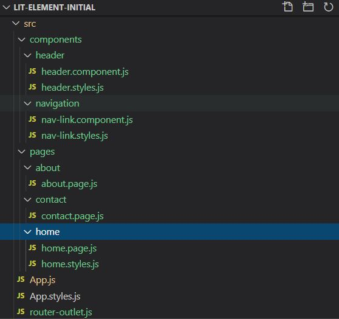

Now let's add routing to our project.

For this we will use `lit-element-router`

Type `npm install lit-element-router` in console

Now let's start restructuring our project

We will separate pages and components for better understanding

Create Project files as given in following image:


Now replace code of _App.js_ file with code given below

```Javascript
import { LitElement, html } from "lit-element";
import { router } from "lit-element-router";

//Components
import "./components/navigation/nav-link.component";
import "./components/header/header.component";
import "./router-outlet";

//pages
import "./pages/home/home.page";
import "./pages/contact/contact.page";
import "./pages/about/about.page";

class App extends router(LitElement) {
  static get properties() {
    return {
      route: { type: String },
      params: { type: Object },
      query: { type: Object },
    };
  }

  static get routes() {
    return [
      {
        name: "home",
        pattern: "",
        data: { title: "Home" },
      },
      {
        name: "about",
        pattern: "about",
      },
      {
        name: "contact",
        pattern: "contact",
      },
      {
        name: "not-found",
        pattern: "*",
      },
    ];
  }

  constructor() {
    super();
    this.route = "";
    this.params = {};
    this.query = {};
  }

  router(route, params, query, data) {
    this.route = route;
    this.params = params;
    this.query = query;
    console.log(route, params, query, data);
  }

  render() {
    return html`
      <app-header></app-header>
      <nav-link href="/">Home</nav-link>
      <nav-link href="/contact">Contact</nav-link>
      <nav-link href="/about">About</nav-link>

      <router-outlet active-route=${this.route}>
        <home-page route="home"></home-page>
        <about-page route="about"></about-page>
        <contact-page route="contact"></contact-page>
        <h1 route="not-found">Not Found</h1>
      </router-outlet>
    `;
  }
}

customElements.define("app-container", App);
```

Now add below code to _router-outlet.js_ file

```Javascript
import { LitElement, html } from "lit-element";
import { outlet } from "lit-element-router";

class RouterOutlet extends outlet(LitElement) {
  render() {
    return html` <slot></slot> `;
  }
}

customElements.define("router-outlet", RouterOutlet);
```

Router outlet will act as a container for the page to which we will switch.

**Slot** is used to render the children of the element. A children is something written between opening and closing tag of element.

Now add following code to _nav-link.component.js_

```Javascript
import { LitElement, html } from "lit-element";
import { navigator } from "lit-element-router";

class NavLink extends navigator(LitElement) {
  static get properties() {
    return {
      href: { type: String },
    };
  }
  constructor() {
    super();
    this.href = "";
  }
  render() {
    return html`
      <a href="${this.href}" @click="${this.handleClick}">
        <slot></slot>
      </a>
    `;
  }
  handleClick(e) {
    e.preventDefault();
    this.navigate(this.href);
  }
}

customElements.define("nav-link", NavLink);
```

Let's add some basic styling to our nav-bar

Wrap nav-links in _App.js_ in div with class nav-container

```Javascript
<div class="nav-container">
    <nav-link href="/">Home</nav-link>
    <nav-link href="/contact">Contact</nav-link>
    <nav-link href="/about">About</nav-link>
</div>
```

Add styling to _App.styles.js_

```Css
.nav-container {
    display: flex;
    justify-content: space-evenly;
}
```

Import styles to _App.js_ and add to return array of _styles()_

Add following code to _nav-link.styles.js_

```Javascript
import { css } from "lit-element";
export const NavLinkStyles = css`
  .nav-link {
    text-decoration: none;
    border: solid 2px black;
    color: black;
    padding: 5px;
    margin-right: 5px;
    border-radius: 5px;
    display: inline-block;
    text-align: center;
  }
  slot {
    font-weight: bold;
  }
  .nav-link:hover {
    color: #ffffff;
    background-color: #000000;
  }
`;
```

Import styles to _nav-link.js_ and add to _styles()_

Add _nav-link_ class to `<a>` tag

```Javascript
<a class="nav-link" href="${this.href}" @click="${this.handleClick}">
    <slot></slot>
</a>
```

Wolaaa! We have a beautiful Nav Bar now.

Now let's add some code to pages.

Add some placeholder code to all pages

_about.page.js_

```Javascript
import { LitElement, css, html } from "lit-element";

class About extends LitElement {
  static get styles() {
    return [css``];
  }
  render() {
    return html` <div>
      <h1>This is About Page</h1>
    </div>`;
  }
  static get properties() {
    return {
      eg: {
        type: String,
      },
    };
  }
  constructor() {
    super();
  }
}
customElements.define("about-page", About);
```

_contact.page.js_

```Javascript
import { LitElement, css, html } from "lit-element";

class Contact extends LitElement {
  static get styles() {
    return [css``];
  }

  render() {
    return html` <div>
      <h1>This is Contact Page</h1>
    </div>`;
  }

  static get properties() {
    return {
      eg: {
        type: String,
      },
    };
  }
  constructor() {
    super();
  }
}

customElements.define("contact-page", Contact);
```

_home.page.js_

```Javascript
import { LitElement, css, html } from "lit-element";

class Home extends LitElement {
  static get styles() {
    return [css``];
  }

  render() {
    return html` <div>
      <h1>This is Home Page</h1>
    </div>`;
  }

  static get properties() {
    return {
      eg: {
        type: String,
      },
    };
  }
  constructor() {
    super();
  }
}

customElements.define("home-page", Home);
```

Now spin up the server by typing `npm start` in console

And try to switch pages by clicking on nav links.

You will notice that as you switch between pages, Url in browser address bar also change.

The is handled by _lit-element-router_.

Now go to a specific route other then "/" and refresh the page

You will get `Cannot GET /contact` in browse.

This is because these routes are generated within our app dynamically and they don't exist till our app loads.

But Since we refreshed the page webpack-dev-server will try to find index.html in route that don't exist and we will get this error.

To fix the we will add a property to dev config file

```Javascript
devServer: {
    historyApiFallback: true,
  },
```

Restart the Server. Now you will see the app will work as intended.

Now whenever webpack detects that given address does not match to any file, it will simply serve the base index file and after that internal router will routes to page specified in URL.

<a href="https://github.com/iamvishal345/lit-element-initial_setup" target="_blank"></a>
